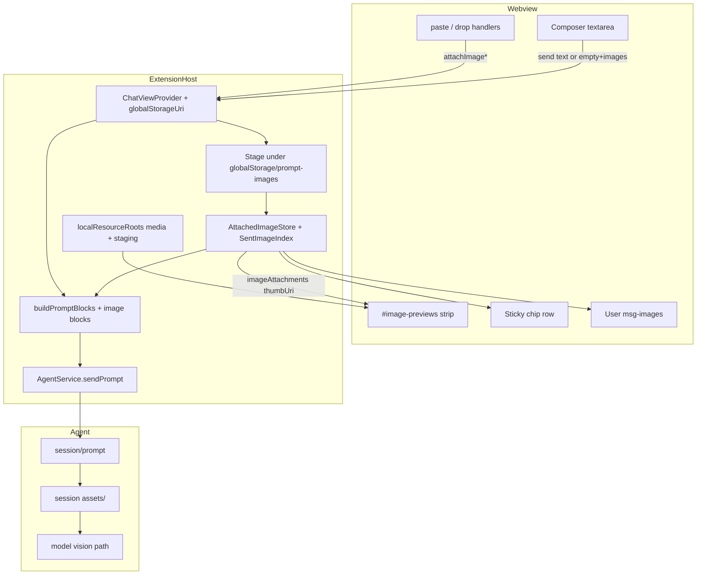

# Design: Images in Prompt for VS Code Extension (TUI Parity)

| Field | Value |
| --- | --- |
| **Title** | Images in prompt for VS Code extension (parity with Grok Build CLI/TUI) |
| **Author** | TBD |
| **Date** | 2026-07-17 |
| **Status** | Draft (rev 2 — review fixes) |
| **Workspace** | `grok-vscode-extension` (client) · `grok-build` (agent/TUI ground truth) |
| **Related docs** | `docs/03-acp-integration.md`, `docs/05-ui-ux.md`, `docs/08-security.md`, TUI `prompt_images.rs`, `PromptWidget::IMAGE_CAP` |

---

## Overview

The Grok Build CLI/TUI already supports multimodal prompts: users paste clipboard images or drop/path-paste image files, see path-free `[Image #N]` chips in the composer, and send ACP `ContentBlock::Image` payloads (base64 + `mimeType` + optional `uri` + `_meta.xai.dev/imageDisplayNumber`). The VS Code extension is still text + `resource_link` only — `AgentService.sendPrompt` already accepts `ContentBlock[]`, and docs mark images as L2+, but the chat webview has no paste/drop/attach path and `buildPromptBlocks` never emits image blocks.

This design adds **TUI-parity image attachments** to the extension chat composer, with a deliberate **IDE upgrade**: the VS Code webview **must render real `` previews** (composer preview strip + chip thumbs + user message bubbles after send). Text-only `[Image #N]` chips without visible images is a **product fail**.

1. **Paste** clipboard image bytes into the composer.
2. **Drop** image files onto the composer region.
3. **Optional** host file-picker command.
4. **Visible image UI**: preview strip + sticky chips with thumbs + post-send bubble images.
5. **Send path** merges user text + image blocks + existing `resource_link` chips into one `session/prompt`.
6. **Session-lifetime staging** so history thumbs keep working until new session / dispose.

The extension remains a **thin ACP client**: validation, staging, and block construction live in the extension host; the webview handles input events and image display. The agent continues to own vision upload, session `assets/` persistence, and `[Image #N]` tool resolution.

---

## Background & Motivation

### Current TUI behavior (ground truth)

Primary model: `PastedImage` in  
`grok-build/crates/codegen/xai-grok-pager-render/src/prompt_images.rs`.

Composer attach gate: `PromptWidget::IMAGE_CAP = 10` in  
`grok-build/crates/codegen/xai-grok-pager/src/views/prompt_widget/mod.rs`  
(`insert_image` rejects with `"Image limit reached (max 10)"`).

| Concern | TUI behavior |
| --- | --- |
| Clipboard paste | `from_clipboard_data` / wrap host path (`GROK_WRAP_IMG\nmime\nbase64`, max **20 MiB**, JPEG recompress) |
| Path paste / drop | `try_read_dropped_paths` / `try_read_images_from_paste` — extension allowlist + magic-byte sniff |
| Composer UX | Path-free chip text via `display_text(n)` → **`[Image #N]`** (terminal cannot show reliable bitmaps) |
| Composer count | **`IMAGE_CAP = 10`** (not the orphan-scan 16) |
| Send | `build_content_blocks_with_*` → `Text` + `Image` blocks; base64 encode; `uri` only from durable `session_image_path` or user `source_path`; `_meta` display number as JSON number |
| Per-image cap | `MAX_SEND_BYTES = 50_000_000` (50 MB) at `load_for_send` |
| Min size | Reject `< 8×8` dimensions on send (when dimensions known) |
| Orphan recovery | `MAX_PLACEHOLDERS_PER_PROMPT = 16`, aggregate **200 MB** — bounds **typed placeholder recovery**, not composer attach |
| Primary paste aggregate | No 200 MB attach-time aggregate on the main `PastedImage` loop (per-image 50 MB only) |
| Persistence | Session `images/` dir (`persist_to_session`); agent also writes `assets/` from prompt images |
| Explicit non-support | No SVG / HEIC / HEIF / AVIF / ICO in `IMAGE_EXTENSIONS` |

Wire shape the agent already consumes (from TUI + ACP SDK + interject tests):

```json
{
  "type": "image",
  "data": "<standard-base64>",
  "mimeType": "image/png",
  "uri": "file:///Users/me/Desktop/shot.png",
  "_meta": {
    "xai.dev/imageDisplayNumber": 1
  }
}
```

Notes:

- `uri` is **optional**. TUI sets it only for a real user source path or durable session image path — **never** for ephemeral temp staging alone.
- `_meta.xai.dev/imageDisplayNumber` must be a **JSON number** (not string) so Rust `display_number_from_meta` (`as_u64`) parses it.
- TS SDK field names (`mimeType`, camelCase) are correct on the wire; Rust uses `mime_type` with serde rename.

TypeScript SDK (`@agentclientprotocol/sdk`):

```typescript
type ImageContent = {
  data: string; // base64
  mimeType: string;
  uri?: string | null;
  annotations?: Annotations | null;
  _meta?: { [key: string]: unknown } | null;
};
// ContentBlock = Text | Image | Audio | ResourceLink | Resource
```

Agent shell extracts image blocks structurally (`image_blocks` in `xai-grok-shell/src/session/mod.rs`), persists to session `assets/`, and resolves `[Image #N]` via `_meta` key `xai.dev/imageDisplayNumber`. When `uri` is present, agent tool references prefer the `file://` path over synthesizing a `data:` URL — so a dead staged path on the wire is actively harmful.

### Current extension behavior

| Piece | Path | State |
| --- | --- | --- |
| Chat host | `src/ui/chatViewProvider.ts` | Sticky **file/selection** chips; `handleSend` → `buildPromptBlocks` → `agent.sendPrompt` |
| Constructor | `ChatViewProvider(extensionUri, …)` | **No** `globalStorageUri` today; `extension.ts` passes `context.extensionUri` only |
| Webview roots | `resolveWebviewView` | `localResourceRoots: [extensionUri/media]` only |
| Prompt build | `src/context/editorContext.ts` | `text` + `resource_link` only |
| ACP send | `src/agent/agentService.ts` `sendPrompt` | Already multipath-ready |
| Empty send gates | webview + host | Send disabled / ignored when `!text.trim()` (three layers) |
| Webview | `media/chat/chat.js` / `chat.css` | Sticky row, no paste/drop image handlers |
| CSP | `getHtml` | `default-src 'none'`; **no `img-src`** |
| Docs | `docs/03-acp-integration.md`, `docs/08-security.md` | Image L2+; roots limited to media |

### Pain points

- Users cannot attach screenshots from the IDE (core TUI workflow).
- `@` / sticky chips attach source files as `resource_link`, not vision tokens.
- Roadmap/docs already promise images; implementation is the missing L2 piece.
- Unlike the TUI, the IDE **can** show bitmaps — shipping text-only chips would be a regression vs product opportunity.

---

## Goals & Non-Goals

### Goals

1. Paste clipboard images into the chat composer and attach them as numbered images.
2. Drag-and-drop image files onto the composer (and path-like paste of local image paths — scoped subset of TUI classifier).
3. Optional command: **Grok Build: Attach Image…** (`showOpenDialog`).
4. Parity chip label: **`[Image #N]`** (1-based; see numbering algorithm).
5. **Show real images in the UI** (required):
   - **Pre-send**: preview strip + chip thumbnails of staged attachments.
   - **Post-send**: user message bubble renders the same images (click → open full size).
6. On send: emit ACP image blocks matching TUI wire format + preserve existing `resource_link` chips.
7. Enforce client limits aligned with TUI composer:
   - mime allowlist, **50 MB raw / image** (dialog/path hard cap), **8×8 min**, **`IMAGE_CAP = 10`**, intentional aggregate soft guard (see KD-5 / Issue 8).
8. Host-side staging; thumbs via `webview.asWebviewUri` after expanding `localResourceRoots` to the staging root.
9. Strict CSP + local-only sources (no remote URL fetch); session-lifetime staging for live history thumbs.
10. End-to-end **image-only send** (webview enablement + host `send` gate + block builder).

### Non-Goals

- Reimplementing agent vision upload, image describe, or `image_edit` tools.
- Scrollback terminal image overlay / Kitty/iTerm graphics protocols.
- SVG, HEIC/HEIF, AVIF, PDF-as-image, or video-in-prompt.
- Fetching `https://…` image URLs from user text.
- Full TUI orphan-placeholder recovery from arbitrary typed `[Image #N: path]` without matching store entries (v1 strips path form only; no 16-slot orphan reload).
- Rehydrating images from **old** sessions after VS Code restart once staging was cleaned (v1: label-only fallback if staged file gone).
- Compressing images to model payload caps on the client (agent already handles conversation sizing).
- Expanding `localResourceRoots` to workspace root or `/`.

---

## Proposed Design

### Architecture



### Host vs webview ownership

| Responsibility | Owner | Notes |
| --- | --- | --- |
| Authoritative attachment list | **Host** (`attachedImages` on `ChatViewProvider`) | Re-posted on every `pushFullState` / `ready` |
| Post-send image index for bubbles | **Host** (`messages[].images` + staged files kept for session) | Thumbs stay valid until new session / dispose |
| Raw bytes / staged file | **Host** under `globalStorageUri/prompt-images/` | Drop in-memory Buffer after stage |
| Thumbnail display | **Webview** `` | Requires CSP **and** `localResourceRoots` |
| Chip remove / renumber | Host mutates store; posts full list + optional composer rewrite | See numbering algorithm |
| ACP `Image` block construction | **Host** only | Re-sniff MIME; never trust webview mime alone |
| Clipboard image capture | **Webview** | Host `vscode.env.clipboard` is text-only |
| File path open / dialog | **Host** | Prefer path; no base64 hop |
| Security validation | **Host** | Allowlist, size, dimensions, magic bytes |
| Storage URI | **Injected** via constructor | See Storage injection |

### Storage injection (`globalStorageUri`)

Today:

```typescript
// extension.ts
new ChatViewProvider(context.extensionUri, agentService, authService, …);

// chatViewProvider.ts
constructor(private readonly extensionUri: vscode.Uri, …) { … }

// resolveWebviewView
localResourceRoots: [vscode.Uri.joinPath(this.extensionUri, "media")],
```

Required:

```typescript
// extension.ts
new ChatViewProvider({
  extensionUri: context.extensionUri,
  globalStorageUri: context.globalStorageUri,
  agent: agentService,
  auth: authService,
  // …
});

// ChatViewProvider
private readonly stagingRoot: vscode.Uri; // globalStorageUri/prompt-images

constructor(opts: {
  extensionUri: vscode.Uri;
  globalStorageUri: vscode.Uri;
  // existing deps…
}) {
  this.stagingRoot = vscode.Uri.joinPath(opts.globalStorageUri, "prompt-images");
}

// resolveWebviewView (primary + secondary)
localResourceRoots: [
  vscode.Uri.joinPath(this.extensionUri, "media"),
  this.stagingRoot,
],
```

Lifecycle:

1. **First attach**: `fs.promises.mkdir(stagingRoot.fsPath, { recursive: true })` (+ per-session subdir if desired).
2. **Dispose** (`ChatViewProvider.dispose` / extension deactivate): `clearAllStagedImages()` — unlink staged files for draft + current session buckets; clear `attachedImages`.
3. **New session** (`runNewSession`): clear composer attachments **and** session staged bucket used for bubble thumbs for the *previous* session; clear `messages` as today (history gone from UI).
4. Do **not** require session id before attach; use `draft/` until `getSessionId()` is known, then may `rename` into `sessions/{sessionId}/`.

### Data model (host)

New module: `src/context/promptImages.ts`

```typescript
/** Mirror of TUI PastedImage fields we need client-side. */
export interface AttachedImage {
  /** Stable id for chip remove (uuid). */
  id: string;
  /** 1-based [Image #N] for current composer draft (dense or monotonic — see algorithm). */
  displayNumber: number;
  mimeType: string;
  byteLen: number;
  width?: number;
  height?: number;
  /** Real user path (dialog / path-paste / native path drop). Never set to staged path. */
  sourcePath?: string;
  /** Client staging path under globalStorage/prompt-images (local UI only). */
  stagedPath: string;
  /** Original basename for chip tooltip. */
  label: string;
}

/** Stored on user UiMessage after send for bubble render. */
export interface MessageImage {
  displayNumber: number;
  mimeType: string;
  /** asWebviewUri of stagedPath while file still exists */
  thumbUri?: string;
  /** Absolute staged or source path for openImage */
  openPath: string;
  width?: number;
  height?: number;
  fileName?: string;
}

export const IMAGE_EXTENSIONS = [
  "png", "jpg", "jpeg", "gif", "webp", "bmp", "tiff", "tif",
] as const;

export const ALLOWED_MIME = new Set([
  "image/png", "image/jpeg", "image/gif",
  "image/webp", "image/bmp", "image/tiff",
]);

/** Match TUI MAX_SEND_BYTES — hard reject at ingest for path/dialog. */
export const MAX_IMAGE_BYTES = 50_000_000;

/** Soft cap for webview→host transfer (clipboard / File drop). Decoded bytes. */
export const MAX_WEBVIEW_TRANSFER_BYTES = 20 * 1024 * 1024;

/**
 * Composer attach cap — match TUI PromptWidget::IMAGE_CAP.
 * (Not MAX_PLACEHOLDERS_PER_PROMPT=16, which is orphan recovery only.)
 */
export const MAX_IMAGES_PER_PROMPT = 10;

/**
 * Intentional client hardening (stricter than TUI attach-time).
 * TUI primary paste loop does not enforce 200 MB aggregate; orphan recovery does.
 * We apply at attach + send as a safety net against multi-image RSS spikes.
 */
export const MAX_AGGREGATE_BYTES = 200 * 1024 * 1024;

export const MIN_DIMENSION = 8;

export const IMAGE_DISPLAY_NUMBER_META_KEY = "xai.dev/imageDisplayNumber";

/**
 * Practical per-prompt base64 payload soft cap for stdio JSON-RPC (v1).
 * Final number set after PR2 spike; start at 12 MiB *decoded* total across images
 * on the ACP prompt (≈16 MiB base64). Per-image path ingest still allows up to
 * MAX_IMAGE_BYTES but send may reject if total encoded payload exceeds soft cap.
 * See "JSON-RPC size policy".
 */
export const MAX_PROMPT_IMAGE_DECODED_BYTES_SOFT = 12 * 1024 * 1024;
```

Staging layout:

```text
{globalStorageUri}/prompt-images/
  draft/image-{uuid}.{ext}           # pre-session
  sessions/{sessionId}/image-…       # after session known + after send copies for history
```

**Cleanup matrix (authoritative):**

| Event | Composer `attachedImages` | Staged files for those attaches | Sent message `images[]` thumbs | Staging files used by sent bubbles |
| --- | --- | --- | --- | --- |
| Chip remove | Remove one | Unlink that staged file | n/a | n/a |
| Successful send | Clear composer list | **Move or copy** into session history bucket (do **not** delete immediately) | Set `msg.images` with `thumbUri`/`openPath` | **Keep** for live session |
| Send failure | Keep attachments | Keep | No new msg images | n/a |
| Webview reload | Keep (host) | Keep | Re-serialize from messages | Keep |
| `runNewSession` | Clear | Unlink draft + previous session bucket | Messages cleared with UI | Unlink |
| Provider dispose / deactivate | Clear | Unlink all under `prompt-images/` | n/a | Unlink |
| Session resume from disk (old session) | Empty | n/a | Label-only if no local stage; **live-turn-only binary history** | No rehydrate v1 |

### Wire format (exact)

```typescript
function imageToBlock(img: AttachedImage, dataBase64: string): ContentBlock {
  const block: ContentBlock = {
    type: "image",
    data: dataBase64,
    mimeType: img.mimeType,
    _meta: {
      // MUST be a JSON number, not a string
      [IMAGE_DISPLAY_NUMBER_META_KEY]: img.displayNumber,
    },
  };
  // Match TUI: uri only for a real user-visible source path.
  // NEVER put ephemeral stagedPath on the wire (agent prefers file:// for tools).
  if (img.sourcePath) {
    block.uri = vscode.Uri.file(img.sourcePath).toString();
  }
  return block;
}
```

Prompt array order:

1. **One** `text` block — user composer text, with path-free `[Image #N]` tokens when present.
2. **Image** blocks for each attachment (display-number order).
3. **resource_link** blocks for sticky file/selection chips + auto-attach (unchanged).

### Composer text + chips + visible images (UX)

TUI inserts a `KIND_IMAGE` element that renders as text `[Image #N]`. **The extension must show the image itself.**

1. **Preview strip** (`#image-previews`, above sticky chips / composer): each attachment is a real `` card (~120–160px max height), badge `[Image #N]`, dims, remove ×, click → `openImage`.
2. **Sticky chips**: `chip chip-image` with **required** thumbnail + label `[Image #N]` + ×. Not text-only.
3. **Composer token**: insert ` [Image #N]` at caret for agent/tool alignment. User may delete tokens; host still sends **all** composer attachments (tokens are UX anchors, not the sole source of truth).
4. **Remove**: host removes attachment; applies numbering algorithm; posts full `imageAttachments`; may rewrite composer tokens.
5. **Post-send user bubble**: `msg-images` gallery with real `` (not only string chips). File `resource_link` chips stay as today’s string chip row.

```mermaid
sequenceDiagram
  participant U as User
  participant W as Webview
  participant H as Host
  participant A as Agent

  U->>W: Paste image / Drop file
  W->>H: attachImageBytes / attachImagePaths
  H->>H: validate, stage under globalStorage, assign #N
  H->>W: imageAttachments + insertImageToken
  W->>W: render preview strip + chip thumb + token
  U->>W: Send (text may be empty)
  W->>H: send { text }
  H->>H: ensure placeholders; load staged → base64 Image blocks
  H->>A: session/prompt
  H->>H: clear composer attaches; keep staged for msg.images
  H->>W: messages with msg.images thumbs
```

### Numbering algorithm (KD-7 detail)

**Product choice: dense renumber 1..N on remove** (simpler UX; **not** exact TUI monotonic `image_counter` parity — documented intentional divergence).

| Event | Behavior |
| --- | --- |
| Attach | `displayNumber = attachedImages.length + 1` (after push, or assign then push). Insert token `[Image #N]` at caret. |
| Remove id | Drop image; renumber remaining to `1..length` in stable order; host posts full list; webview rewrites **only** tokens that matched previous known numbers via map `{old→new}`; tokens with no mapping removed or left and fixed on send. |
| Send | `ensureImagePlaceholders(text, images)`: for each store image missing a `[Image #N]` token, append ` [Image #N]`. Strip path-form `[Image #N: …]` → `[Image #N]`. User-authored orphans like `[Image #99]` with no store entry: leave text as-is (model may ignore); do not invent attachments. |
| User edits mid-sentence | Tokens are plain text; renumber rewrite uses regex `\[[Ii]mage #(\d+)\]` only on known previous numbers. |

Optional future: monotonic IDs (TUI-like) to reduce rewrite complexity — not v1.

### Paste flow

#### A. Clipboard image bytes (primary)

1. Webview `paste` on `#composer` / `.composer-shell` (capture).
2. If any `clipboardData.items` has `type.startsWith("image/")`: `preventDefault()`.
3. `getAsFile()` → check extension/mime lightly → `arrayBuffer()`.
4. Measure **decoded** `byteLength = buffer.byteLength` **before** base64; if `> MAX_WEBVIEW_TRANSFER_BYTES`, reject in webview with message (do not base64, do not postMessage).
5. Base64 encode → postMessage:

```typescript
{
  type: "attachImageBytes",
  mimeType: file.type || "image/png",
  dataBase64: string,
  byteLength: number, // decoded size
  name?: string
}
```

6. Host: decode → re-sniff → dims → caps → stage → `postImageAttachments()` → `insertImageToken`.

If clipboard has both text and image, prefer **image** when an image item is present.

#### B. Path text paste (v1 scoped subset of TUI)

**In scope:**

- Anchors: absolute Unix paths, `~/…`, `file://…`, Windows `X:\` / `X:/`, UNC `\\`.
- Normalize line endings; split on newlines then whitespace tokens.
- Strip matching single/double quotes around a token.
- Reject tokens containing NUL / CR / LF inside the path.
- **All-or-nothing**: if any token fails to resolve as an existing path (for bare paths) or valid `file://`, fall through entire paste as **plain text** (TUI any-token-fail).
- **Images only**: tokens that are images attach; non-image paths in an otherwise-valid all-path paste are **ignored for attach** in v1 (not sticky-filed) — if zero images resulted, fall through to text.
- Host: `{ type: "attachImagePaths", paths: string[] }` after webview heuristic, **or** webview sends raw paste text and host runs classifier (prefer **host-side classifier** for security consistency).

**Out of scope v1:** full TUI mixed image+non-image sticky behavior, markdown `` paste, relative paths without anchor.

**Fixtures:** port representative cases from `prompt_images.rs` `try_read_dropped_paths` tests where practical.

### Drop flow

1. `dragover` / `drop` on `.composer-wrap` (and preview strip); `preventDefault`; CSS `drag-over`.
2. For each file:
   - Prefer native path if VS Code provides it → `attachImagePaths`.
   - Else File API bytes → same as clipboard path with decoded-size precheck.
3. **Partial success**: attach until count (10) or aggregate fails; report one summary (`Attached 3 of 7 images (limit reached).`).
4. Precheck mime/extension before `arrayBuffer()` when possible to avoid reading huge non-images.

### File picker command

```text
command: grok.attachImage
title: Grok Build: Attach Image…
```

- `showOpenDialog({ canSelectMany: true, filters: { Images: […] } })`
- Host reads paths directly (no webview base64).
- Same validation/staging pipeline; sets `sourcePath`.

### UI details — always show the image

#### Pre-send HTML

```html
<div id="image-previews" class="image-previews" hidden>
  <figure class="image-card" data-image-id="…">
    <button type="button" class="image-card-open" title="Open full size">
      
    </button>
    <figcaption>
      <span class="image-card-label">[Image #1]</span>
      <span class="image-card-meta">1920×1080 · PNG</span>
      <button type="button" class="image-card-remove" title="Remove">×</button>
    </figcaption>
  </figure>
</div>

<span class="chip chip-image" title="screenshot.png (1920×1080)">
  
  <span class="chip-label">[Image #1]</span>
  <button type="button" data-image-id="…" title="Remove">×</button>
</span>
```

#### Post-send user bubble

```html
<div class="msg-images">
  <figure class="msg-image">
    
    <figcaption>[Image #1]</figcaption>
  </figure>
</div>
<div class="bubble">…text…</div>
```

- Horizontal wrap; max-height ~180px; click → host `openImage`.
- Broken URI after unexpected cleanup: placeholder + label (degraded), not silent empty.
- **Transcript resume from disk:** live-turn-only binary images; after resume, show text placeholders from stored user text if present, not binary chips (v1 non-goal).

#### Resource roots + CSP (both required)

**CSP** add:

```text
img-src ${webview.cspSource};
```

(`data:` only if we temporarily use object URLs for in-flight paste preview before host ACK; revoke immediately. Prefer no `https:`.)

**`localResourceRoots`** (critical — CSP alone is insufficient):

```typescript
localResourceRoots: [
  vscode.Uri.joinPath(this.extensionUri, "media"),
  this.stagingRoot, // globalStorageUri/prompt-images
],
```

Apply to **primary and secondary** chat webviews. Update `docs/08-security.md` to document staging root exception (staging only — never workspace root or `/`).

Without working thumbs, the feature is **broken** (not a soft degradation to text chips).

### Errors

| Condition | Message |
| --- | --- |
| Unsupported type | `Unsupported image type (use PNG, JPEG, GIF, WebP, BMP, or TIFF).` |
| Too large (hard) | `Image exceeds 50 MB limit.` |
| Webview transfer | `Clipboard image exceeds 20 MB transfer limit — save to disk and Attach Image…` |
| Soft prompt cap | `Attached images are too large to send in one prompt (limit ~12 MB total). Remove some or attach fewer.` |
| Too small | `Image is smaller than 8×8 pixels.` |
| Too many | `Image limit reached (max 10).` |
| Aggregate | `Attached images exceed 200 MB total.` |
| Unreadable | `Could not read image file.` |
| Corrupt | `File is not a valid image.` |
| RPC send fail | Keep attachments; `Failed to send images — attachments preserved. {reason}` |

### Send path — end-to-end image-only

Today three gates block empty text:

1. Webview `updateSendStopButton`: `empty = !composer.value.trim()`.
2. Webview submit: `if (!text) return;`.
3. Host `case "send": if (msg.text?.trim()) handleSend…`.

**Required contract:**

```typescript
// Webview
const canSend =
  !cliMissing &&
  (!!composer.value.trim() || attachedImageCount > 0 || /* existing busy→stop */);
// enable Send when canSend (idle)

// submit
const text = composer.value; // may be "" 
if (!text.trim() && attachedImageCount === 0) return;
vscode.postMessage({ type: "send", text });

// Host onMessage
case "send": {
  const text = String(msg.text ?? "");
  if (!text.trim() && this.attachedImages.length === 0) break;
  await this.handleSend(text);
  break;
}
```

`handleSend`:

```typescript
const snapshot = [...this.attachedImages];
const { blocks, chips, imageLabels } = buildPromptBlocks(text, {
  stickyChips: this.stickyChips,
  images: snapshot,
});
// Soft payload check before RPC
const decodedTotal = snapshot.reduce((n, i) => n + i.byteLen, 0);
if (decodedTotal > MAX_PROMPT_IMAGE_DECODED_BYTES_SOFT) {
  this.pushSystem(/* soft cap message */);
  return; // keep attachments
}

// User bubble (when not queue-only path)
this.messages.push({
  type: "user",
  id: userId,
  text: /* final text after ensure placeholders */,
  chips: chips.map((c) => c.label),
  images: snapshot.map((img) => this.toMessageImage(img, webview)),
  promptIndex: nextPromptIndex(this.messages),
});

try {
  await this.agent.sendPrompt(blocks, { promptId, queueText: text || imageLabels.join(" ") });
  // SUCCESS: clear composer attachments only; keep staged files for msg.images
  this.clearComposerAttachments({ unlink: false, promoteToSession: true });
} catch (err) {
  // FAILURE: do NOT clear attachments
  …
}
```

Queue-while-busy: same send gates; optimistic queue row text can be first line of text or `[Image #1]` summary; still send full blocks.

### Validation pipeline

```typescript
async function ingestImageBytes(input: {
  bytes: Buffer;
  claimedMime?: string;
  sourcePath?: string;
}): Promise<AttachedImage | { error: string }>
```

Steps:

1. Empty → error.
2. `bytes.length > MAX_IMAGE_BYTES` → error.
3. `mime = sniffMime(bytes)`; not in `ALLOWED_MIME` → error.
4. **Dimensions (decision):** use a **small pure-TS header parser** covering PNG/JPEG/GIF/WebP/BMP + common TIFF enough for width/height (no full pixel decode).  
   - If dims **known** and either edge `< 8` → reject at attach.  
   - If dims **unknown** (rare/truncated TIFF): still allow if magic sniff passed + size ok; agent is final decoder. Log `dims=unknown`.  
   - Corrupt magic that sniffs as image but fails header parse: reject as corrupt when parser is confident; otherwise defer to agent (document in tests with truncated PNG fixture).
5. Count (`>= 10`) / aggregate (`> 200 MB`) against current store → error.
6. Stage to disk under `stagingRoot`; return `AttachedImage`.

Path ingest: `fs.stat` size pre-check → read → same. Sets `sourcePath` to resolved user path.

### JSON-RPC size policy

| Cap | Value | When |
| --- | --- | --- |
| Per-image hard | 50 MB decoded | Path/dialog ingest |
| Webview transfer | 20 MB decoded | Clipboard / File drop before base64 |
| Composer count | 10 | Attach |
| Aggregate | 200 MB | Attach (intentional hardening) |
| **Prompt soft total** | **12 MB decoded default** (tune after spike) | Before `sendPrompt` |

**PR2 spike (blocking for claiming large-image support):**

1. Attach / send synthetic PNGs of ~1, 5, 10, 15 MB via `AgentService.sendPrompt` over current stdio path.
2. Record max reliable total decoded size on macOS/Linux.
3. Set `MAX_PROMPT_IMAGE_DECODED_BYTES_SOFT` to measured safe value with margin.
4. UX: reject send with clear message; **keep attachments**.
5. Do **not** advertise 50 MB × 10 as a practical single-prompt capability in README.

---

## Full-state restore + clear matrix

### `pushFullState` additions

```typescript
// host → webview (inside existing pushFullState / ready)
{
  type: "fullState", // existing envelope
  // …
  imageAttachments: Array<{
    id: string;
    label: string;           // "[Image #N]"
    displayNumber: number;
    thumbUri: string;        // asWebviewUri(stagedPath)
    title?: string;          // basename + dims
    width?: number;
    height?: number;
  }>,
  // messages[] already include images?: MessageImage[] with thumbUri recomputed
}
```

On webview `ready` / after `pushFullState`: `renderImagePreviews(imageAttachments)`; restore `attachedImageCount` for send button.

Also keep dedicated incremental message:

| `type` | Payload | Purpose |
| --- | --- | --- |
| `imageAttachments` | same array as above | Full replace after attach/remove |
| `insertImageToken` | `{ token, displayNumber }` | Caret insert |
| `rewriteComposerImageTokens` | `{ text }` **or** `{ renumber: Record<string, number> }` | Prefer full controlled rewrite only when host owns token map; default **renumber map** + client applies |
| `imageAttachError` | `{ message }` | Soft error |
| `openImage` (wv→host) | `{ id }` or `{ path }` | Open full size |

### Clear policy (single choice)

| Event | Policy |
| --- | --- |
| Webview reload | **Restore** composer attachments + message thumbs from host |
| Successful send | Clear **composer** attachments; keep staged for **message** thumbs |
| New session | Clear composer + messages + unlink session staging |
| Dispose | Unlink all staging |

---

## API / Interface Changes

### Webview → host

| `type` | Payload | Purpose |
| --- | --- | --- |
| `attachImageBytes` | `{ mimeType, dataBase64, byteLength, name? }` | Clipboard / File API (`byteLength` = decoded) |
| `attachImagePaths` | `{ paths: string[] }` | Dialog / path paste / native drop |
| `attachImagePasteText` | `{ text: string }` | Optional: host runs path classifier |
| `removeImage` | `{ id: string }` | Chip / card × |
| `openImage` | `{ id?: string, path?: string }` | Full-size open |
| `send` | `{ text: string }` | **May be empty** if host has attachments |

### Host → webview

| `type` | Payload | Purpose |
| --- | --- | --- |
| `imageAttachments` | `{ attachments: […] }` | Full replace preview + chips |
| `insertImageToken` | `{ token, displayNumber }` | Insert at caret |
| `rewriteComposerImageTokens` | `{ renumber: Record<number, number> }` or `{ text }` | After remove |
| `imageAttachError` | `{ message }` | Error line |
| `fullState` | includes `imageAttachments` + messages with `images` | Reload restore |

### Host commands / construction

| Item | Change |
| --- | --- |
| `grok.attachImage` | New command |
| `ChatViewProvider` ctor | Add `globalStorageUri` |
| `extension.ts` | Pass `context.globalStorageUri` |
| `localResourceRoots` | media + stagingRoot |
| `docs/08-security.md` | Document staging root |

### `AgentService`

No protocol change. On RPC failure, surface error; caller must not clear attachments.

---

## Data Model Changes

No required settings for MVP. Optional later:

```json
"grok.images.maxBytes": 50000000,
"grok.images.maxCount": 10,
"grok.images.promptSoftMaxBytes": 12582912
```

**Migration:** none.

---

## Alternatives Considered

### 1. Webview holds all bytes until send

Rejected — memory, postMessage cliffs, reload loss, weaker re-validation.

### 2. `resource_link` only instead of `type: "image"`

Rejected — not TUI/agent vision path; tools need image blocks + display-number meta.

### 3. Host-only clipboard via native module

Rejected — VS Code has no image clipboard API; native addons out of scope.

### 4. Chips only (no `[Image #N]` tokens)

Rejected for parity — weaker tool reference story.

### 5. Data-URL thumbs only (no `localResourceRoots` expansion)

Viable fallback if staging-root expansion is blocked, but **rejected as primary**: full-res data URLs bloat DOM; product requires real previews of staged files. Expanding roots to **staging only** is the chosen approach.

### 6. Client JPEG recompress for wrap-size screenshots

Deferred — soft-reject >20 MiB webview transfers; path/dialog use soft prompt total instead.

### 7. Count = 16 (orphan constant)

Rejected — overshoots TUI composer `IMAGE_CAP = 10`.

---

## Security & Privacy Considerations

| Threat | Severity | Mitigation |
| --- | --- | --- |
| Remote URL fetch SSRF | Med | No URL download |
| Arbitrary local file read into model | Med | Same power as TUI path paste; host `fs` only; log basenames only; optional later workspace-scoped setting |
| Path traversal | Med | `realpath` / resolve; reject non-files |
| MIME spoofing | Med | Magic-byte sniff + extension allowlist on path branch |
| Decompression bomb | High | Byte cap before parse; header-only dims; no full pixel decode on host |
| CSP bypass | Med | No `https:` in `img-src` |
| **`localResourceRoots` over-expansion** | High | Expand **only** to `globalStorageUri/prompt-images` (+ media). Never workspace root or `/` |
| Dead `uri` on tools | Med | Never put staged path on ACP `uri` |
| Sensitive screenshots in logs | Med | Never log base64 |
| Leftover staged files | Low | Cleanup matrix on new session / dispose |
| Oversized JSON-RPC | High | Soft prompt cap + spike; keep attachments on failure |

Auth: unchanged. Privacy: treat images as user prompt content.

---

## Observability

| Signal | Where |
| --- | --- |
| attach success | mime, decoded bytes, dims, source |
| attach reject | reason code |
| send images | count, totalDecodedBytes, softCapHit |
| rpc fail | error class (no payload) |
| Output channel | Existing Grok output |

---

## Rollout Plan

1. **No feature flag for v1** — ship default-on once PR3 manual matrix 1–6 pass. Optional kill-switch only if needed post-ship.
2. **CLI compatibility:** requires current mainline grok-build multimodal `session/prompt` (already on CE’s supported agent). **No version pin** unless CE already versions the bundled/probed binary; document in README: “requires recent Grok CLI with image prompt support (current mainline).”
3. **PR sequence:** PR1 → PR2 (incl. spike) → PR3 → PR4 → PR5 (docs only after manual tests).
4. **Rollback:** revert PRs; staging under globalStorage is disposable.

---

## Testing Plan

### Unit (`promptImages.test.ts`)

- MIME sniff + reject SVG/HTML polyglots / empty / >50 MB / <8×8 when dims known.
- `MAX_IMAGES_PER_PROMPT === 10`.
- `imageToBlock`: no `uri` without `sourcePath`; `uri` set with sourcePath; `_meta` number type.
- Placeholders ensure/strip/renumber map.
- Aggregate + count caps.
- Path classifier subset fixtures.

### Host / integration

- Staging mkdir under mock storage URI.
- `buildPromptBlocks` merge order.
- Empty text + images → non-empty blocks.
- Soft cap rejects send without clearing store.

### PR2 spike

- Measure max reliable stdio image payload; lock soft cap.

### Manual / E2E

1. Paste screenshot → **bitmap in preview strip** + chip thumb + token → send.
2. After send → **user bubble shows image**; click opens; composer cleared; thumb still works.
3. Drop multiple → cards 1..N → remove middle → dense renumber.
4. Dialog attach large JPEG under soft total; CSP clean.
5. Reject .svg / .heic / oversized.
6. **Image-only send** (empty composer text, attachments present) from webview + host.
7. Image + `@file` same turn.
8. Mid-turn queue with image.
9. Webview reload restores composer attachments + bubble thumbs.
10. New session clears previews and unlinks staging.
11. Send RPC failure preserves attachments.
12. Regression: text-only chip without `` is a fail.
13. Confirm ACP payload omits `uri` for clipboard images (agent log / debug).

### Parity fixtures

Tiny PNG generator pattern from TUI tests.

---

## Open Questions

1. ~~Renumber vs monotonic~~ → **Decided:** dense 1..N for v1 (documented divergence).
2. Path-paste non-image → sticky file chips? Deferred.
3. ~~JSON-RPC size~~ → **Decided process:** soft cap + PR2 spike; default 12 MB decoded total.
4. Cross-restart history rehydrate from agent assets? Deferred.
5. Edit/resubmit with images: v1 display if stage exists; no re-send of missing bytes without re-attach.
6. Narrow sidebar gallery layout: horizontal wrap; stack under ~280px width.

---

## References

- TUI image model: `xai-grok-pager-render/src/prompt_images.rs`
- TUI composer cap: `xai-grok-pager/src/views/prompt_widget/mod.rs` `IMAGE_CAP = 10`
- Wrap clipboard: `xai-grok-pager/src/wrap_clipboard_image.rs`
- Shared caps / meta: `xai-grok-shared/src/placeholder_images.rs` (orphan 16 / 200 MB — not composer cap)
- MIME sniff: `xai-grok-shared/src/clipboard.rs` `mime_from_bytes`
- Agent: `xai-grok-shell` `image_blocks`, `persist_user_images`
- Extension: `editorContext.ts`, `chatViewProvider.ts`, `agentService.ts`
- Security docs: `docs/08-security.md` (update with staging root)
- ACP SDK: `ImageContent` / `ContentBlock`

---

## Key Decisions

| ID | Decision | Rationale |
| --- | --- | --- |
| KD-1 | ACP `type: "image"` with base64 + `mimeType` + **optional** `uri` **only if `sourcePath`** + `_meta.xai.dev/imageDisplayNumber` as **number** | TUI/agent contract; avoid dead staged URIs on tools |
| KD-2 | Host owns attachments + staging; webview is capture + display | Thin client, security, reload |
| KD-3 | Clipboard capture in webview | Only viable path |
| KD-4 | Prefer path ingest when available | Avoid large postMessage |
| KD-5 | Limits: 50 MB/image hard, **10** composer images (`IMAGE_CAP`), 8×8 when dims known, raster allowlist; **200 MB aggregate as intentional stricter client guard**; **~12 MB decoded soft total per prompt** (spike-tuned) | True TUI composer parity on count; honest RPC limits |
| KD-6 | Webview transfer 20 MiB decoded; no client recompress v1 | Wrap parity; clear UX |
| KD-7 | Tokens + sticky chips + **real `` previews**; dense renumber 1..N | IDE upgrade + simple UX |
| KD-8 | Block order: `text` → `image`* → `resource_link`* | TUI + existing chips |
| KD-9 | No remote URL fetch | Security |
| KD-10 | CSP `img-src` **and** `localResourceRoots += stagingRoot` (staging only) | Thumbs actually load |
| KD-11 | **Keep staged files for live session after send** for bubble thumbs; clear on new session / dispose; clear **composer** list on send success only | Product: show images in history |
| KD-12 | Image-only prompts end-to-end (webview + host gates) | TUI parity |
| KD-13 | Always render real `` (strip + chips + bubbles) | Product requirement |
| KD-14 | Thumbs via `asWebviewUri(stagedPath)` | Memory + CSP local-only |
| KD-15 | `MessageImage[]` on user messages | History shows pictures |
| KD-16 | Inject `globalStorageUri` into `ChatViewProvider` | Staging + roots |
| KD-17 | No feature flag v1; no hard CLI version pin | Ship with mainline multimodal agent |
| KD-18 | On send failure, never clear attachments | User does not lose screenshots |

---

## PR Plan

### PR 1 — Host image ingest + ACP block builders

- **Title:** `feat(images): host-side image validation, staging, and ContentBlock builders`
- **Files:**
  - `src/context/promptImages.ts` (new) — caps **10**, soft prompt total constant, sniff, dims headers, `imageToBlock` (**uri only if sourcePath**), placeholders, staging helpers taking `stagingRoot: Uri | string`
  - `src/context/promptImages.test.ts` (new)
  - `src/context/editorContext.ts` — extend `buildPromptBlocks` with `images?: AttachedImage[]`
  - tests for `buildPromptBlocks` merge
- **Dependencies:** none
- **Description:** Pure logic + unit tests. No webview. Document intentional aggregate hardening.

### PR 2 — ChatViewProvider storage, roots, send gates, full state

- **Title:** `feat(images): ChatViewProvider image store, storage URI, send gates, full-state`
- **Files:**
  - `src/ui/chatViewProvider.ts` — ctor `globalStorageUri`; `stagingRoot`; `localResourceRoots`; `attachedImages`; handlers `attachImageBytes` / `attachImagePaths` / `removeImage` / `openImage`; **host `send` empty-text exception**; `handleSend` merge + soft cap; **do not clear on RPC failure**; clear composer on success with **promote/keep stage**; `runNewSession` / dispose cleanup; **`pushFullState.imageAttachments`** + message `images[]` with recomputed `thumbUri`
  - `src/extension.ts` — pass `context.globalStorageUri`
  - `docs/08-security.md` — staging root in `localResourceRoots`
- **Dependencies:** PR 1
- **Acceptance / spike:**
  - [ ] Image-only send works with empty text from host path (unit/integration or manual with stub webview message)
  - [ ] Reload/`pushFullState` restores attachments
  - [ ] New session / dispose cleans staging
  - [ ] **Stdio payload spike** (~1/5/10/15 MB); set `MAX_PROMPT_IMAGE_DECODED_BYTES_SOFT`
  - [ ] Clipboard-style block omits `uri`; path attach includes `uri`

### PR 3 — Webview paste/drop, previews, CSP, image-only UI gates

- **Title:** `feat(images): composer paste/drop + real image previews + history bubbles`
- **Files:**
  - `media/chat/chat.js` — paste/drop; decoded-size precheck; partial multi-drop; `updateSendStopButton` / submit empty+images; preview strip; chip thumbs; `msg-images`; renumber map apply
  - `media/chat/chat.css` — preview strip, cards, msg-images, chip-image, drag-over
  - `src/ui/chatViewProvider.ts` — CSP `img-src`; HTML `#image-previews`
- **Dependencies:** PR 2
- **Description:** Full UX. Feature **fails QA** if images not visible. Secondary webview same CSP/roots.

### PR 4 — Attach Image command

- **Title:** `feat(images): Grok Build: Attach Image… command`
- **Files:** `package.json`, `src/extension.ts`, `chatViewProvider.attachFromDialog`
- **Dependencies:** PR 2 (PR 3 preferred for visible UI)
- **Description:** Multi-select dialog; host path ingest with `sourcePath`.

### PR 5 — Docs (only after manual matrix)

- **Title:** `docs(images): ACP image prompts shipped + manual test plan`
- **Files:** `docs/03-acp-integration.md`, `docs/05-ui-ux.md`, README tips, this design (already in specs)
- **Dependencies:** PR 3–4
- **Checklist before merge:** Manual tests 1–6 pass (paste, bubble, drop, dialog, reject, image-only). Do **not** mark “implemented” earlier.

### Merge order

```text
PR1 → PR2 (+ spike) → PR3 → PR4 → PR5
                 ↘ PR4 may parallel PR3 after PR2
```

---

## Risks

| Risk | Severity | Mitigation |
| --- | --- | --- |
| Stdio JSON-RPC too large | High | Soft prompt cap + PR2 spike; keep attachments on failure |
| Webview postMessage huge clipboard | Med | Decoded byteLength precheck before base64 |
| Dim parse gaps (TIFF) | Low | Magic allow + unknown dims policy |
| Dense renumber vs user-typed tokens | Low | Map rewrite + ensure on send |
| Forgetting `localResourceRoots` | High | PR2 acceptance; security doc |
| Staged path leaked as `uri` | High | `imageToBlock` unit test; never set staged uri |
| Thumbnail CSP/root on secondary view | Med | Shared options helper for all chat webviews |

---

## Appendix A — Limit cheat sheet

| Constant | Value | Role |
| --- | --- | --- |
| `PromptWidget::IMAGE_CAP` | **10** | **Composer attach/send count (client parity)** |
| `MAX_SEND_BYTES` | 50_000_000 | Per-image hard (TUI `load_for_send`) |
| Min dimension | 8×8 | When dims known |
| `MAX_WRAP_IMAGE_BYTES` | 20 MiB | Webview transfer soft |
| `MAX_PLACEHOLDERS_PER_PROMPT` | 16 | Orphan recovery only — **not** client attach cap |
| `MAX_PLACEHOLDER_AGGREGATE_BYTES` | 200 MiB | Orphan recovery; we reuse as **intentional attach aggregate guard** |
| `MAX_PROMPT_IMAGE_DECODED_BYTES_SOFT` | ~12 MiB (spike) | Practical stdio send total |
| Display meta key | `xai.dev/imageDisplayNumber` | JSON **number** |
| Chip text | `[Image #N]` | `display_text` |
| Extensions | png jpg jpeg gif webp bmp tiff tif | No svg/heic/avif/ico |

## Appendix B — Example `session/prompt` bodies

### Clipboard paste (no user path — omit `uri`)

```json
{
  "sessionId": "…",
  "prompt": [
    {
      "type": "text",
      "text": "What's wrong with this layout? [Image #1]"
    },
    {
      "type": "image",
      "data": "iVBORw0KGgoAAAANSUhEUgAA…",
      "mimeType": "image/png",
      "_meta": {
        "xai.dev/imageDisplayNumber": 1
      }
    },
    {
      "type": "resource_link",
      "uri": "file:///Users/me/proj/src/App.tsx",
      "name": "App.tsx",
      "description": "/Users/me/proj/src/App.tsx"
    }
  ],
  "_meta": { "promptId": "…" }
}
```

### Dialog / path attach (include user `uri`)

```json
{
  "type": "image",
  "data": "…",
  "mimeType": "image/jpeg",
  "uri": "file:///Users/me/Desktop/screenshot.png",
  "_meta": { "xai.dev/imageDisplayNumber": 1 }
}
```

## Appendix C — `localResourceRoots` snippet

```typescript
function chatWebviewOptions(extensionUri: vscode.Uri, stagingRoot: vscode.Uri) {
  return {
    enableScripts: true,
    localResourceRoots: [
      vscode.Uri.joinPath(extensionUri, "media"),
      stagingRoot,
    ],
  };
}
```
